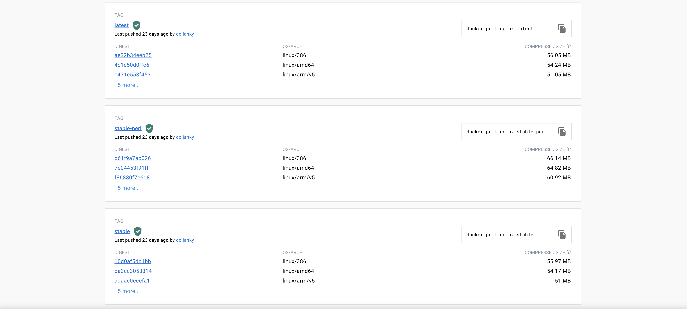
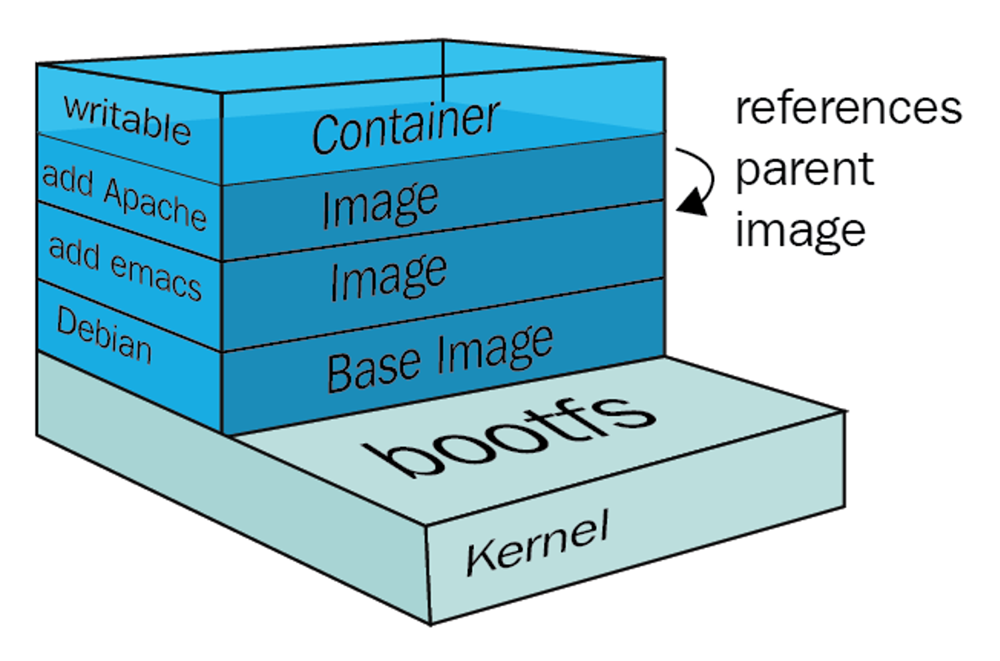
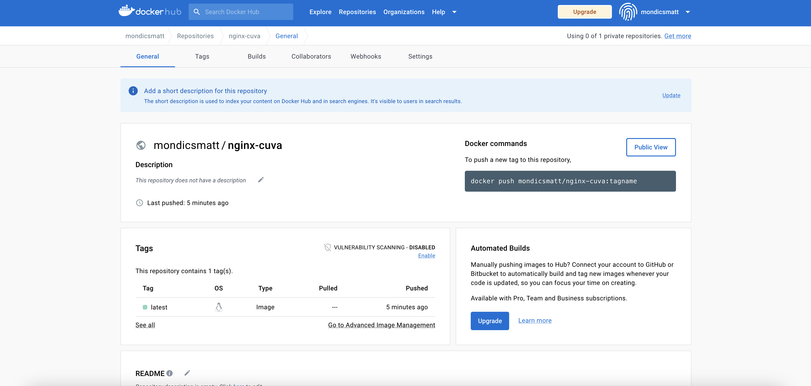
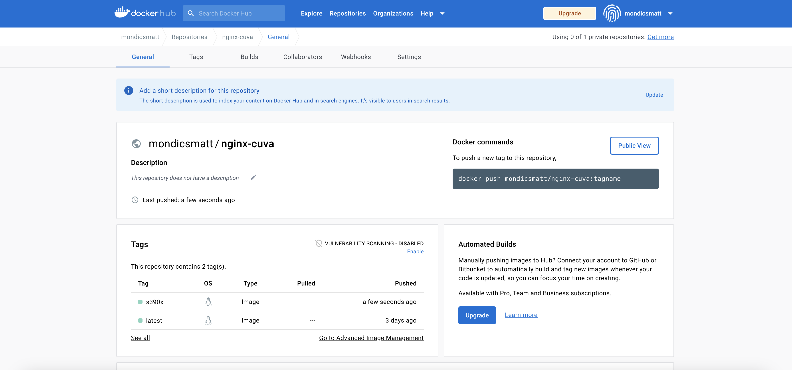
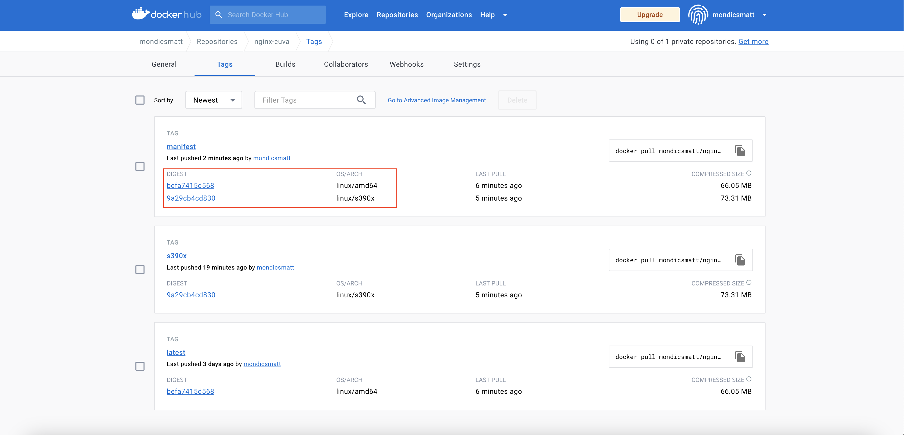

# podman-intro
 
In this tutorial, you will walk through an introduction to Podman and learn some of the basics of containers, container images, registries, building images from Dockerfiles, and building multi-architecture container images that will run on different hardware architectures such as ARM, IBM zSystems, IBM Power. 

## Pre-Requisites
1. Sign up for a free [DockerHub account](https://hub.docker.com/)
2. Install the [Podman CLI](https://podman.io/getting-started/installation)

Before diving into Podman, you must first understand the concept of containers.

## Containerization Overview

Containers are executable units of software in which application code is packaged, along with its libraries and dependencies, in common ways so that it can be run anywhere, whether it be on desktop, traditional IT, or the cloud.

To do this, containers take advantage of a form of operating system (OS) virtualization in which features of the OS (in the case of the Linux kernel, namely the namespaces and cgroups primitives) are leveraged to both isolate processes and control the amount of CPU, memory, and disk that those processes have access to.

Containers are small, fast, and portable because unlike a virtual machine, containers do not need include a guest OS in every instance and can, instead, simply leverage the features and resources of the host OS.

Containers first appeared decades ago with versions like FreeBSD Jails and AIX Workload Partitions, but most modern developers remember 2013 as the start of the modern container era with the introduction of Docker.


### Benefits of Containers

The primary advantage of containers, especially compared to a VM, is providing a level of abstraction that makes them lightweight and portable.

- **Lightweight**: Containers share the machine OS kernel, eliminating the need for a full OS instance per application and making container files small and easy on resources. Their smaller size, especially compared to virtual machines, means they can spin up quickly and better support cloud-native applications that scale horizontally.  

- **Portable and platform independent**: Containers carry all their dependencies with them, meaning that software can be written once and then run without needing to be re-configured across laptops, cloud, and on-premises computing environments.

- **Supports modern development and architecture**: Due to a combination of their deployment portability/consistency across platforms and their small size, containers are an ideal fit for modern development and application patterns—such as DevOps, serverless, and microservices—that are built are regular code deployments in small increments.

- **Improves utilization**: Like VMs before them, containers enable developers and operators to improve CPU and memory utilization of physical machines. Where containers go even further is that because they also enable microservice architectures, application components can be deployed and scaled more granularly, an attractive alternative to having to scale up an entire monolithic application because a single component is struggling with load.


[Source and more information](https://www.ibm.com/topics/containers)

## Containers vs. Container Images

For those who are new to containers, Kubernetes, and the cloud-native ecosystem, the terminology can be tricky. The term "Container" especially has come to represent various different technologies. This section will delineate the difference between *Containers*,  *Container Images* and *Container Engines*. 

**Containers** are *running processes*, usually Linux-based, that include all of the application code, any binaries or files required by the application code, as well as an extremely slim, virtualized portion of the Linux operating system.

**Container Images** are *templates* from which *Containers* are started. You can think of a Container Image as a clean snapshot of a container at a point in time. Instantiating the Container Image as a running Container will result in a virtually identical Container, no matter which physical machine or virtualized environment it is running in.

**Container Engines** are the platforms that enable the use of containers in a Linux (usually) environment, as well as the platform which end users interact with. Docker was the defacto Container Engine that popularized the technology, but Podman is a modern replacement that fixes many issues that exist in Docker, which are discussed in a later section.

In short, an end user uses Podman to run a Container Image as a Container on any environment where the Podman engine is running.

## Podman Overview


Podman is an open-source project that is available on most Linux platforms and resides on GitHub. Podman is a daemonless container engine for developing, managing, and running Open Container Initiative (OCI) containers and container images on your Linux System. Podman provides a Docker-compatible command line front end that can simply alias the Docker cli, alias docker=podman. Podman also provides a socket activated REST API service to allow remote applications to launch on-demand containers. This REST API also supports the Docker API, allowing users of docker-py and docker-compose to interact with the Podman as a service.

Containers under the control of Podman can either be run by root or by a non-privileged user. Podman manages the entire container ecosystem which includes pods, containers, container images, and container volumes using the libpod library. Podman specializes in all of the commands and functions that help you to maintain and modify OCI container images, such as pulling and tagging. It allows you to create, run, and maintain those containers created from those images in a production environment.

The Podman service runs only on Linux platforms, however the podman remote REST API client exists on Mac and Windows platforms and can communicate with the Podman service running on a Linux machine or VM via ssh. Mac/Windows client.

[Source and more information](https://podman.io/whatis.html)

## Podman vs. Docker

As mentioned in the previous section, those who are familiar with Docker can quite easily transition to Podman and gain the benefits/improvements that will be discussed in this section. Many users and organizations choose to simply `alias docker=podman` to make this transition even easier.

One of the most important benefits of Podman over Docker is that Podman runs daemonless. The daemon which the Docker CLI interacts with introduces a single point of failure and a great target for security risk because the Docker daemon requires root privileges to manage containers. Podman running daemonless makes the architecture more secure, available, and simplified.

Without a daemon, Podman interacts directly with `runc`, the container runtime that supports OCI-compliant container images. OCI (`Open Container Initiative`) compliance means that Podman containers and images adopt open standards and governance around container formats and runtimes. OCI was established by Docker, and Docker images are OCI-compliant. To the end user, this means that any image you built with Docker will also run with Podman, and vice-versa.

Podman also runs rootless by default. This means that you can run rootless containers without any additional configuration - and root or non-root user can use Podman to run containers. Docker has introduced this ability as time went on, but it does require additional configuration.

Lastly, Podman supports the concept of deploying multiple containers in one Pod. This is vitally important for many applications that require a "sidecar" or monitoring agent container, as two examples. Docker has no concept of a "Pod", it simply deploys containers with a one-by-one basis.

## Container Registries

**Container Registries** are repositories that store Container Images. Container Registries often support pushing and pulling Container Images into and out of the registry either manually by developers, or automatically as part of a DevSecOps pipeline.


Some of the popular container registries are:
- DockerHub
- quay.io
- IBM Container Registry (icr)

Container Registries often store multiple versions of the Container Image - denoted by *tags*. For example, you can look at the tags for the official `nginx` container image in DockerHub.

<https://hub.docker.com/_/nginx>



The images in this screenshot can be represented in the Podman CLI as follows.

```text
docker.io/library/nginx:stable
```

Where:
- `docker.io` is the DockerHub container registry
- `library` is the specific registry within DockerHub. In this case, this is an official image hosted by DockerHub itself.
- `nginx` is the container image name
- `stable` is the tag.

1. Your first hands-on step of this tutorial will be to log in to DockerHub via the command line.

    ```text
    podman login docker.io
    ```

    Enter your Docker credentials when prompted.

    Logging in to DockerHub is required to push images into your own repositories, which is a later step in this tutorial.

## Pulling Container Images

Pulling Container Images to your local machine (or whichever machine you are running the Podman CLI from) is quite easy, which you will see in this section.

The configuration file for which registries Podman can access is located at `/etc/containers/registries.conf`. Note that while Podman supports Mac and Windows, on these operating systems it embeds a guest Linux system to launch your containers. This guest is referred to as a Podman machine and is managed with the `podman machine` command. On Mac and Windows, you can check the `registries.conf` file with the command `podman machine ssh cat /etc/containers/registries.conf`.

2. Pull the official Nginx Container Image to your local machine.

    ```text
    podman pull docker.io/library/nginx:latest
    ```

    Sample Output:

    ```text
    ➜  ~ podman pull docker.io/library/nginx:latest
    Trying to pull docker.io/library/nginx:latest...
    Getting image source signatures
    Copying blob sha256:b2fe3577faa434a4ca212810cb5d245ab0923d078b44d17f9e26609772f655bf
    Copying blob sha256:8740c948ffd4c816ea7ca963f99ca52f4788baa23f228da9581a9ea2edd3fcd7
    Copying blob sha256:d2c0556a17c5d136fc0387f936672d6922c0ee0c412e39f10bdb9abea3790815
    Copying blob sha256:c8b9881f2c6a7c0a4b133402af9b73c6d7f481ac9b455f6f96e6181f12a8a78a
    Copying blob sha256:693c3ffa8f43a3ae70d512c7add694b6c66a3d69262c4433acd3e0aa6d0d8b8b
    Copying blob sha256:8316c5e80e6d3abc453220bd5858bb7bd5ac08d8b79a13378b500d6e70f91c1d
    Copying config sha256:a99a39d070bfd1cb60fe65c45dea3a33764dc00a9546bf8dc46cb5a11b1b50e9
    Writing manifest to image destination
    Storing signatures
    a99a39d070bfd1cb60fe65c45dea3a33764dc00a9546bf8dc46cb5a11b1b50e9
    ```

    You now have the nginx container image stored locally.

3. Show the local copy of the nginx image.

    ```text
    podman images
    ```

    Sample Output: 

    ```text
    ➜  ~ podman images
    REPOSITORY               TAG         IMAGE ID      CREATED      SIZE
    docker.io/library/nginx  latest      a99a39d070bf  3 weeks ago  146 MB
    ```

4. View detailed information about the container image with `podman inspect`

    ```text
    podman inspect docker.io/library/nginx:latest
    ```

    You could also use the `IMAGE ID`, or a unique subset of the Image ID, instead of the full image name.

    For example, in the example above.

    `podman inspect a99` would have the same output, as there are no other container images with an ID that begins with `a99`.

## Running a Container

Now that you have a container image stored locally, the next step is to run it as a container.

5. Run the container with the following command.

    ```text
    podman run --name nginx -d -p 8080:80 docker.io/library/nginx:latest
    ```

    This command has various optional flags added.

    - `-name`: specifies the name for the container. Omitting this tag would result in Podman generating a random name for the container. 
    - `-d`: runs the container in "detached" mode, meaning it will run in the background and you will be given back access to your terminal session.
    - `-p`: port-forwards from the localhost to the container host. In this case, Podman maps `localhost:8080` to the container port `80` so you can access the nginx web server.

    Finally, you specify the container image which you would like to run. Again, you could have instead used the unique Image ID rather than the full name. 

    You also could have immediately executed this `podman run` command without first executing the `podman pull`. Podman would have pulled the container image automatically from a container registry if it was not found locally.

6. In a web browser, navigate to <localhost:8080> to see your nginx service running.

    

    If you see the `Welcome to nginx!` message, your pod is up and running and port `80` in the pod is exposed to your localhost port `8080`.

    There are many containerized applications that are pre-packaged and need no changes. However, with a web server container image like nginx, you will usually want to make modifications such as adding an `index.html` file along with associated configuration files and images required to display a webpage.

## Building a New Container Image

7. Clone this GitHub repository which contains files for the Cuyahoga Valley National Park website.

    ```text
    git clone https://github.com/mmondics/podman-intro
    ```

8. Change into the `podman-intro` directory.

    ```text
    cd podman-intro
    ```

    In this repository, you'll find a `Containerfile` and a `cuva` directory.

    ```text
    ➜  podman-intro git:(main) ls -al
    total 80
    drwxr-xr-x    8 mattmondics  staff    256 Feb  3 09:09 .
    drwx------@ 263 mattmondics  staff   8416 Feb  3 09:09 ..
    drwxr-xr-x   12 mattmondics  staff    384 Feb  3 09:09 .git
    -rw-r--r--    1 mattmondics  staff    136 Feb  3 09:09 Containerfile
    -rw-r--r--    1 mattmondics  staff  13014 Feb  3 09:09 README.md
    -rw-r--r--    1 mattmondics  staff  19877 Feb  3 09:09 container-registries.drawio.png
    drwxr-xr-x    5 mattmondics  staff    160 Feb  3 09:09 cuva
    drwxr-xr-x    6 mattmondics  staff    192 Feb  3 09:09 images
    ```

**Containerfiles** are text files that are used to build new container images. They are an extremely flexible, reusable, and extensible way to make changes to existing "parent" container images such as a simple Linux distribution, or in the case of this tutorial, a base nginx server. Containerfiles allow their users to pull the existing parent image, make any changes necessary, and build a new customized "child" image.

If you're familiar with Docker, you can think of a *Containerfile* as analogous to a *Dockerfile*. They have identical structure and use. *Containerfile* is simply the nomenclature used by OCI-compliant containerization tools including Podman.

9. Open the `Containerfile` with your favorite editor (`vi`, `nano`, VSCode, TextEdit, etc.)

    ```text
    FROM nginx:latest

    LABEL description='This Containerfile will customize the parent nginx container image'

    LABEL website='Cuyahoga Valley National Park'

    ENV THIS_IS a_variable

    EXPOSE 80

    COPY default.conf /etc/nginx/conf.d/

    COPY ./cuva /usr/share/nginx/html/

    # Below is a hacky way to do this, but helpful to represent multi-command RUN instructions.

    RUN ARCH=`dpkg --print-architecture` && \
        echo $ARCH > /tmp/container_arch && \
        CONTAINER_ARCH=$(cat /tmp/container_arch) && \
        sed -i "s|HOSTARCH|$CONTAINER_ARCH|g" /usr/share/nginx/html/index.html
    ```

    This Containerfile is essentially a sequential list of instructions that will be run in series to create the child container image. This is a relatively simple Containerfile with *some* of the supported instructions, which are outlined below.

    - `FROM`: specifies the parent container image to build from. If the image exists locally, that image is used which avoids the need for a `podman pull` and will speed up the process of the container image build. If it does not exist locally, podman will look at the registries it knows about (via the configuration file mentioned earlier) and pulls it locally. You can also specify which registry to pull the parent image from by simply prepending the registry like you did earlier, i.e. `docker.io/library/nginx:latest`.
    - `LABEL`: adds a key-label pair to the metadata of the child container image. These are helpful to provide information to the eventual users of the image (maintainer contacts, software versions, etc) as well as help to keep your container images organized. 
    - `ENV`: sets environment variables in the child container. The variables you set with `ENV` will be visible (with the `env` command) and usable in the eventual container.
    - `EXPOSE`: simply specifies the port on which the container will listen. This *does not* actually expose the port - it only adds the correct port to the image metadata. You expose the port when running the container with `podman run -p`
    - `COPY`: copies files from the local directory where the Containerfile is to a target directory in the container image. Another option to do so is the `ADD` instruction which has the additional benefit of adding files from other locations (different servers or the internet) as well as unpacking `.tar` files in the target directory. Neither of these benefits are supported by the `COPY` instruction.
    - `RUN`: executes the following commands within the child container image

Each one of these instructions forms a new *layer* within the child image. When you pulled the parent nginx image earlier, each one of the "blobs" you saw represents one layer of the image. The layered approach that Podman uses enables rapid changes and updates without the need for the full image to be pushed and pulled. For example, if you edit only one of the instructions in the Containerfile, such as modifying the `RUN` instruction, only that blob will need to be pushed or pulled into or out of the registry the next time it's used. In the modern DevSecOps world where images are rapidly changing and evolving, this greatly increases the speed of development and also cuts down on storage requirements. 

Because of this layered approach, it generally makes sense to combine `RUN` instructions into one line with `&&` operands, as in the example above.




10. Close out of the Containerfile if it's running in your terminal session.

11. Build a new container image from the Containerfile.

    While in the `podman-intro` directory which contains the `Containerfile`:

    ```text
    podman build -t localhost:nginx-cuva .
    ```

    In the command above, the `-t` flag is used to set the registry and image name as `localhost:nginx-cuva`, and the `.` simply says to build from the current directory. Because you did not specify a tag for the image, `latest` will be provided as the default.

    Sample output:
    ```text
    ➜  podman-intro git:(main) ✗ podman build -t localhost/nginx-cuva .
    STEP 1/8: FROM nginx:latest
    STEP 2/8: LABEL description='This Containerfile will customize the parent nginx container image'
    --> 979bc8cbba8
    STEP 3/8: LABEL website='Cuyahoga Valley National Park'
    --> 6bdd4cbf4ea
    STEP 4/8: ENV THIS_IS a_variable
    --> 6bda5bc6294
    STEP 5/8: EXPOSE 80
    --> b207341526c
    STEP 6/8: COPY default.conf /etc/nginx/conf.d/
    --> 77f482514f0
    STEP 7/8: COPY ./cuva /usr/share/nginx/html/
    --> d7ccfca0e02
    STEP 8/8: RUN ARCH=`dpkg --print-architecture` &&     echo $ARCH > /tmp/container_arch &&     CONTAINER_ARCH=$(cat /tmp/container_arch) &&     sed -i "s|HOSTARCH|$CONTAINER_ARCH|g" /usr/share/nginx/html/index.html
    COMMIT localhost:nginx-cuva
    --> e9dc1f9df67
    Successfully tagged localhost/localhost:nginx-cuva
    e9dc1f9df67c0db4d4b94f41b3876baf703818bb1003aca59620d8b01b6dd0cc
    ```

    You'll notice that each instruction in the Containerfile matches a `STEP` in the output, each has its own layer (the randomly generated characters after each `STEP`), and the final child image is listed at the end with its own image ID.

12. Look at your new container image.

    ```text
    podman images
    ```

    Sample output:

    ```text
    ➜  podman-intro git:(main) ✗ podman images
    REPOSITORY               TAG         IMAGE ID      CREATED       SIZE
    localhost/nginx-cuva     latest      d3d1292de632  11 hours ago  163 MB
    docker.io/library/nginx  latest      a99a39d070bf  3 weeks ago   146 MB
    ```

    You can now run the child container image as a container just like you did with the parent nginx image.

## Run the Customized Container Image

13. If your parent nginx container is still running, stop it first. You cannot have two pods trying to use the same port on one system.

    ```text
    podman stop docker.io/library/nginx:latest
    ```

14. Run the new container image.

    ```text
    podman run -d -p 8080:80 localhost/nginx-cuva:latest
    ```

15. Navigate to <http://localhost:8080> in a web browser.

    

The entire website with all images, links, pages, etc are running in your single container. This is not the most microservices-friendly example - most organizations will have multiple containers running separate components of their application so that if one component goes down, it will be isolated to just that component and not affect the others.

This container image is only running locally. If you'd like to share it with others, or run it on a server elsewhere, you can push it to a container registry.

## Push the Customized Container Image to DockerHub

You should still be logged into DockerHub. If you aren't, refer to the [earlier section](#container-registries). 

Remember that your container image is tagged with the `localhost` registry. This needs to be modified to your target container registry - DockerHub for this tutorial.

16. Re-tag the container image for DockerHub.

    ```text
    podman tag localhost/nginx-cuva:latest docker.io/your_dockerhub_username/nginx-cuva:latest
    ```

    Replace `your_github_username` with the username with which you are logged into DockerHub.

17. Look at your local container images again.

    ```text
    podman images
    ```

    Sample output:

    ```REPOSITORY                        TAG         IMAGE ID      CREATED       SIZE
    localhost/nginx-cuva              latest      d3d1292de632  12 hours ago  163 MB
    docker.io/mondicsmatt/nginx-cuva  latest      d3d1292de632  12 hours ago  163 MB
    docker.io/library/nginx           latest      a99a39d070bf  3 weeks ago   146 MB
    ```

    Notice that the re-tagged image has the same `IMAGE ID`. Re-tagging images is simply used to move them to and from registries - but it is an identical container under the hood.

18. Push the re-tagged image to your DockerHub registry.

    ```text
    podman push docker.io/your_dockerhub_username/nginx-cuva:latest
    ```

    Again, remember to change `your_dockerhub_username`.

    Sample output:

    ```text
    ➜  podman-intro git:(main) ✗ podman push docker.io/mondicsmatt/nginx-cuva:latest
    Getting image source signatures
    Copying blob sha256:80115eeb30bc12d360f0e102c2ef98176079305e9a1f99074093e1965cd23511
    Copying blob sha256:67a4178b7d47beb6a1f697a593bd0c6841c67eb0da00f2badefb05fd30671490
    Copying blob sha256:7e7121bf193a9d6c7623520cdfe2c1d58da671d201ed13a21525574f8522d32d
    Copying blob sha256:8477a329ab95b790e1d4be0ff5761a85f39a7344cb45fb8e3f35442155c05945
    Copying blob sha256:ff1154af28db5b3a94015268111cc49d5dd3fe7370cf2e328425d3d99f12bdb8
    Copying blob sha256:049fd3bdb25d6b2c0e821db681c0ade756f03f14a1966fb7fc17f208065dce6b
    Copying blob sha256:957eddbb87d7e0d1a872ca5239f64f9a766bff4199eb6c2efbc70ed828c00347
    Copying blob sha256:87db0b0441ea1d06e566fc3e4d5254def22b0158e81106926525cfab815b6e3d
    Copying blob sha256:93e388fe3209a20dba47c994746fad7f867ffbc37299b060c01016e0f1b8c2ee
    Copying config sha256:d3d1292de6326fbfb95937c34fbd8a55a623bfb4b046efc566aeafd236529deb
    Writing manifest to image destination
    Storing signatures
    ```

19. Navigate to <https://hub.docker.com/> in a web browser and log in.

    

    Your image is now publicly accessible in DockerHub and can be pulled into Linux servers or Kubernetes cluster.

20. Click the tile for your container image to see more details.

    

## (optional) Building Multi-Architecture Container Images

**The remainder of this lab will work if you're running Podman on a Mac. Windows *should* work, but has not been tested. It will not work if you're running Podman on a RHEL virtual machine. If you're using RHEL, feel free to simply read through these instructions to see the process.**

In the hybrid multicloud world we are now living in, there is a great benefit to developing new applications with the mentality of "Build Once, Deploy Anywhere". It is far better to develop an application one time and be able to run it on any platform - IBM zSystems, IBM Power, x86, public cloud - rather than having to re-write the application for any new architecture that is brought into an environment. 

Building a multi-architecture container image, or Container Manifest, enables the following use cases for IBM zSystems:

- Integrating `s390x` (Linux on IBM zSystems architecture) into DevSecOps toolchains alongside `amd64` (x86 architecture) or public cloud environments
- Failing over from public cloud or x86 to IBM zSystems environments for disaster recovery
- Migrating applications to different architectures for performance, sustainability, or availability purposes

Podman supports builds for platform architectures different from that of the Podman host. For example, you can build an `s390x` container image from an `amd64` Linux server or even your local laptop or desktop. This is particularly beneficial to developers or DevOps pipelines who don't have access to each of the target architectures for development.

Building a container image for a different architecture can be achieved by running a `podman build` with the `--platform` flag. Alternatively, the `--all-platforms` flag can be used to build for all platform architectures supported by the *parent image* in a Containerfile.

While `podman build` is happy to use base images and build images for any platform that exists, `RUN` instructions in a Containerfile will not be able to succeed without the help of emulation provided by packages like `qemu-user-static`. [source and more information](https://docs.podman.io/en/latest/markdown/podman-build.1.html)

[QEMU](https://www.qemu.org/) (short for Quick Emulator) is a free and open-source emulator that emulators machine processors through dynamic binary translation to allow interoperability of guest operating systems. QEMU allows podman to not only *build* container images for different platforms, but also allows you to *run* different platform images.

21.  Install the `qemu-user-static` package onto your local podman machine.

    ```text
    podman machine ssh sudo rpm-ostree install qemu-user-static
    ```

22.  Reboot your podman machine.

    ```text
    podman machine ssh sudo systemctl reboot
    ```

    Wait a minute or two for the changes to apply and for the virtual podman machine to reboot. While you wait, you can read more about the `qemu-user-static` package [here](https://github.com/multiarch/qemu-user-static).

    Once Podman has rebooted, you can move on to building a `s390x` version of your container image. You can check that Podman is back up by running `podman images`. If you receive an error, the Podman machine is not back up yet.

23.  Use the qemu emulator to build an `s390x` version of the customized nginx container image. Remember to edit the command below to reflect `your_dockerhub_username`.

    ```text
    podman build --platform=linux/s390x -t docker.io/your_dockerhub_username/nginx-cuva:s390x .
    ```

    Sample output:

    ```text
    ➜  podman-intro git:(main) ✗ podman build --platform=linux/s390x -t docker.io/mondicsmatt/nginx-cuva:s390x .
    STEP 1/8: FROM nginx:latest
    STEP 2/8: LABEL description='This Containerfile will customize the parent nginx container image'
    --> b979b16dfe5
    STEP 3/8: LABEL website='Cuyahoga Valley National Park'
    --> 034f043c8cc
    STEP 4/8: ENV THIS_IS a_variable
    --> 6b824f629f8
    STEP 5/8: EXPOSE 80
    --> 289d3d79e57
    STEP 6/8: COPY default.conf /etc/nginx/conf.d/
    --> a6dbc80e75e
    STEP 7/8: COPY ./cuva /usr/share/nginx/html/
    --> 5158dd460e9
    STEP 8/8: RUN ARCH=`dpkg --print-architecture` &&     echo $ARCH > /tmp/container_arch &&     CONTAINER_ARCH=$(cat /tmp/container_arch) &&     sed -i "s|HOSTARCH|$CONTAINER_ARCH|g" /usr/share/nginx/html/index.html
    COMMIT docker.io/mondicsmatt/nginx-cuva:s390x
    --> 67f223fd1fe
    [Warning] one or more build args were not consumed: [TARGETARCH TARGETOS TARGETPLATFORM]
    Successfully tagged docker.io/mondicsmatt/nginx-cuva:s390x
    67f223fd1febef947fe4283764c858e50efcc9e1d0c4fe0c97f2965094a8a2b0
    ```

24.  Run the `s390x` container image on port 8081 so it doesn't try to use the same port as your original container.

    ```text
    podman run -d -p 8081:80 docker.io/your_dockerhub_username/nginx-cuva:s390x
    ```

    Note: you might receive a warning from Podman telling you that the container architecture does not match that of the Podman host. This can be ignored.

25.  Navigate to <http://localhost:8081> in a web browser.

    

    You should notice that the webpage now displays `Cuyahoga Valley running on s390x`. This is the result of the `RUN` command identifying the container's host architecture and injecting it into the `index.html` page served by the nginx server. You're now running the container on an emulated `s390x` operating system on your laptop or desktop, but this container could be run on any Linux on IBM zSystems server as well as in z/OS Container Extensions as well as OpenShift on IBM zSystems.

26.  Push the s390x container image to your DockerHub repository.

    ```text
    podman push docker.io/your_dockerhub_username/nginx-cuva:s390x
    ```

27.  Navigate back to your DockerHub repository in a web browser to see the pushed image.

    

    You now can see the `s390x` tag alongside `latest`. These are two separate container images named `nginx-cuva` in the same Container Registry - demarcated by their tags.

    At this point, if you wanted to deploy this application to either an `amd64` or `s390x` server or OpenShift cluster, you would need to specify which tag to deploy. In order to more fully adopt the hybrid multi-architecture model, you want to build a *Container Manifest* that acts as a wrapper around these two container images and will automatically select which tag to deploy after identifying the target environment.

28.  Create a container manifest.

    ```text
    podman manifest create docker.io/your_dockerhub_username/nginx-cuva:manifest
    ```

29.  Add the two container images to the manifest.

    ```text
    podman manifest add docker.io/your_dockerhub_username/nginx-cuva:manifest docker.io/your_dockerhub_username/nginx-cuva:latest
    podman manifest add docker.io/your_dockerhub_username/nginx-cuva:manifest docker.io/your_dockerhub_username/nginx-cuva:s390x
    ```

30. Inspect the manifest to see that it references each architecture image.

    ```text
    podman manifest inspect docker.io/your_dockerhub_username/nginx-cuva:manifest
    ```

    Sample output:
    ```text
    ➜  podman-intro git:(main) ✗ podman manifest inspect docker.io/mondicsmatt/nginx-cuva:manifest
    {
        "schemaVersion": 2,
        "mediaType": "application/vnd.docker.distribution.manifest.list.v2+json",
        "manifests": [
            {
                "mediaType": "application/vnd.oci.image.manifest.v1+json",
                "size": 1851,
                "digest": "sha256:befa7415d5689419f8775a6bf1207a0ed8d7068acc121f43acdf9f4bd0319f81",
                "platform": {
                    "architecture": "amd64",
                    "os": "linux"
                }
            },
            {
                "mediaType": "application/vnd.oci.image.manifest.v1+json",
                "size": 1851,
                "digest": "sha256:9a29cb4cd8307aa9f404645472bf8d7995c75208dae9e6eb3afb3b1f30813d28",
                "platform": {
                    "architecture": "s390x",
                    "os": "linux"
                }
            }
        ]
    }
    ```

31. Push the container manifest to your DockerHub registry.

    ```text
    podman push docker.io/your_dockerhub_username/nginx-cuva:manifest
    ```

32. Finally, navigate to your DockerHub registry in a web browser, and navigate to the "Tags" tab.

    

    You should see two different architectures listed for the *manifest* tag. 

Your multi-architecture container manifest can be deployed onto any x86 or IBM zSystems server or OpenShift cluster without needing to pick a specific tag. The container runtime on that server or cluster will identify and pull the appropriate container image.

## Conclusion

In this tutorial, you have learned about containers, images, registries, and how to build and run them on various platform architectures. To build on this knowledge, you may be interested in learning about [Kubernetes](https://kubernetes.io/) - the defacto container orchestrator that will help manage large numbers of containers, or [OpenShift](https://www.redhat.com/en/technologies/cloud-computing/openshift), the Kubernetes-based container platform that is the foundation of IBM and Red Hat's hybrid cloud strategy.