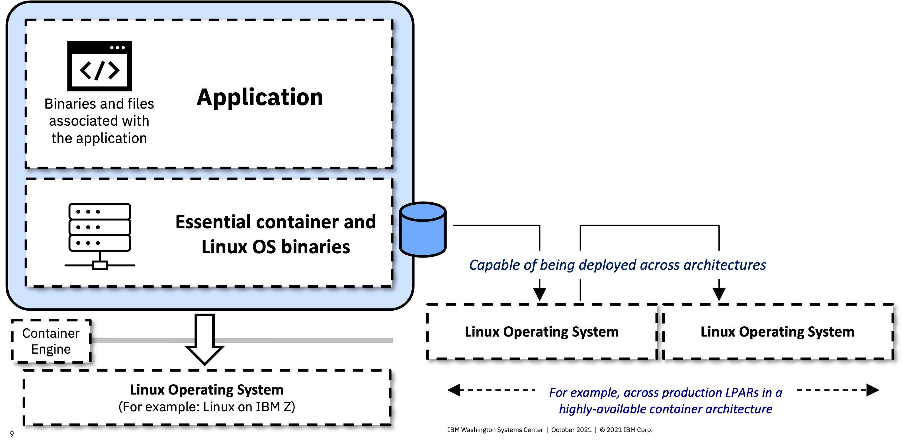
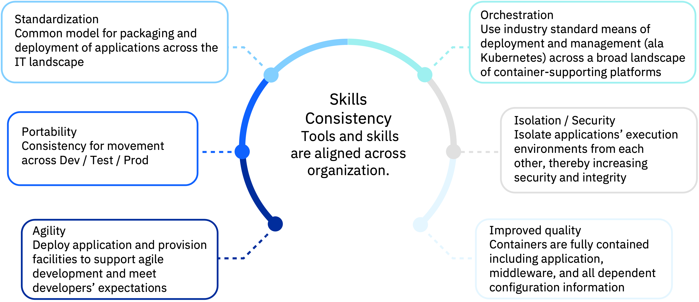
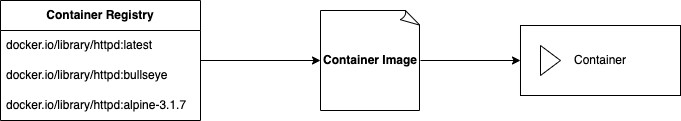
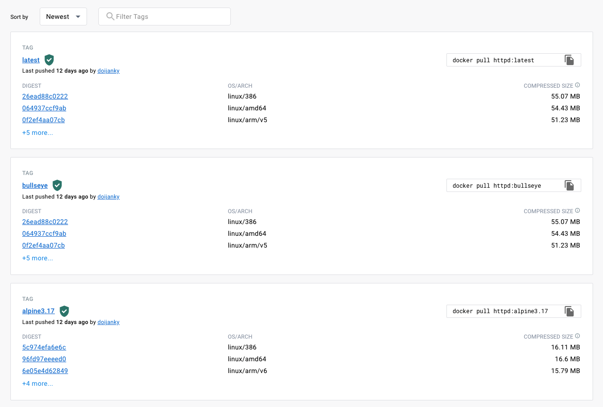

# podman-intro
 
In this tutorial, you will walk through an introduction to Podman and learn some of the basics of containers, container images, registries, building images from Dockerfiles, and building multi-architecture container images that will run on different hardware architectures such as ARM, IBM zSystems, IBM Power. 

## Pre-Requisites
1. Sign up for a free [DockerHub account](https://hub.docker.com/)
2. [Podman CLI installed](https://podman.io/getting-started/installation)

Before diving into Podman, you must first understand the concept of containers.

## Containerization Overview

Containers are executable units of software in which application code is packaged, along with its libraries and dependencies, in common ways so that it can be run anywhere, whether it be on desktop, traditional IT, or the cloud.

To do this, containers take advantage of a form of operating system (OS) virtualization in which features of the OS (in the case of the Linux kernel, namely the namespaces and cgroups primitives) are leveraged to both isolate processes and control the amount of CPU, memory, and disk that those processes have access to.

Containers are small, fast, and portable because unlike a virtual machine, containers do not need include a guest OS in every instance and can, instead, simply leverage the features and resources of the host OS.

Containers first appeared decades ago with versions like FreeBSD Jails and AIX Workload Partitions, but most modern developers remember 2013 as the start of the modern container era with the introduction of Docker.



### Benefits of Containers

The primary advantage of containers, especially compared to a VM, is providing a level of abstraction that makes them lightweight and portable.

- **Lightweight**: Containers share the machine OS kernel, eliminating the need for a full OS instance per application and making container files small and easy on resources. Their smaller size, especially compared to virtual machines, means they can spin up quickly and better support cloud-native applications that scale horizontally.  

- **Portable and platform independent**: Containers carry all their dependencies with them, meaning that software can be written once and then run without needing to be re-configured across laptops, cloud, and on-premises computing environments.

- **Supports modern development and architecture**: Due to a combination of their deployment portability/consistency across platforms and their small size, containers are an ideal fit for modern development and application patterns—such as DevOps, serverless, and microservices—that are built are regular code deployments in small increments.

- **Improves utilization**: Like VMs before them, containers enable developers and operators to improve CPU and memory utilization of physical machines. Where containers go even further is that because they also enable microservice architectures, application components can be deployed and scaled more granularly, an attractive alternative to having to scale up an entire monolithic application because a single component is struggling with load.



[Source and more information](https://www.ibm.com/topics/containers)

## Containers vs. Container Images

For those who are new to containers, Kubernetes, and the cloud-native ecosystem, the terminology can be tricky. The term "Container" especially has come to represent various different technologies. This section will delineate the difference between *Containers*,  *Container Images* and *Container Engines*. 

**Containers** are *running processes*, usually Linux-based, that include all of the application code, any binaries or files required by the application code, as well as an extremely slim, virtualized portion of the Linux operating system.

**Container Images** are *templates* from which *Containers* are started. You can think of a Container Image as a clean snapshot of a container at a point in time. Instantiating the Container Image as a running Container will result in a virtually identical Container, no matter which physical machine or virtualized environment it is running in.

**Container Engines** are the platforms that enable the use of containers in a Linux (usually) environment, as well as the platform which end users interact with. Docker was the defacto Container Engine that popularized the technology, but Podman is a modern replacement that fixes many issues that exist in Docker, which are discussed in a later section.

In short, an end user uses Podman to run a Container Image as a Container on any environment where the Podman engine is running.

## Podman Overview

Podman is an open-source project that is available on most Linux platforms and resides on GitHub. Podman is a daemonless container engine for developing, managing, and running Open Container Initiative (OCI) containers and container images on your Linux System. Podman provides a Docker-compatible command line front end that can simply alias the Docker cli, alias docker=podman. Podman also provides a socket activated REST API service to allow remote applications to launch on-demand containers. This REST API also supports the Docker API, allowing users of docker-py and docker-compose to interact with the Podman as a service.

Containers under the control of Podman can either be run by root or by a non-privileged user. Podman manages the entire container ecosystem which includes pods, containers, container images, and container volumes using the libpod library. Podman specializes in all of the commands and functions that help you to maintain and modify OCI container images, such as pulling and tagging. It allows you to create, run, and maintain those containers created from those images in a production environment.

The Podman service runs only on Linux platforms, however the podman remote REST API client exists on Mac and Windows platforms and can communicate with the Podman service running on a Linux machine or VM via ssh. Mac/Windows client.

[Source and more information](https://podman.io/whatis.html)

## Podman vs. Docker

As mentioned in the previous section, those who are familiar with Docker can quite easily transition to Podman and gain the benefits/improvements that will be discussed in this section. Many users and organizations choose to simply `alias docker=podman` to make this transition even easier.

One of the most important benefits of Podman over Docker is that Podman runs daemonless. The daemon which the Docker CLI interacts with introduces a single point of failure and a great target for security risk because the Docker daemon requires root privileges to manage containers. Podman running daemonless makes the architecture more secure, available, and simplified.

Without a daemon, Podman interacts directly with `runc`, the container runtime that supports OCI-compliant comtainer images. OCI (`Open Container Initiative`) compliance means that Podman containers and iaages adopt open standards and governance around container formats and runtimes. OCI was established by Docker, and Docker images are OCI-compliant. To the end user, this means that any image you built with Docker will also run with Podman, and vice-versa.

Podman also runs rootless by default. This means that you can run rootless containers without any additional configuration - and root or non-root user can use Podman to run containers. Docker has introduced this ability as time went on, but it does require additional configuration.

Lastly, Podman supports the concept of deploying multiple containers in one Pod. This is vitally important for many applications that require a "sidecar" or monitoring agent container, as two examples. Docker has no concept of a "Pod", it simply deploys containers with a one-by-one basis.

## Container Registries

**Container Registries** are repositories that store Container Images. Container Registries often support pushing and pulling Container Images into and out of the registry either manually by developers, or automatically as part of a DevSecOps pipeline.



Some of the popular container registries are:
- DockerHub
- quay.io
- IBM Container Regisry (icr)

Container Registries often store multiple versions of the Container Image - denoted by *tags*. For example, you can look at the tags for the official `httpd` container image in DockerHub.

<https://hub.docker.com/_/httpd>



The images in this screenshot can be represented in the Podman CLI as follows.

```text
docker.io/library/httpd:bullseye
```

Where:
- `docker.io` is the DockerHub container registry
- `library` is the specific registry within DockerHub. In this case, this is an official image hosted by DockerHub itself.
- `httpd` is the container image name
- `bullseye` is the tag.

1. Your first hands-on step of this tutorial will be to log in to DockerHub via the command line.

    ```text
    podman login docker.io
    ```

    Enter your Docker credentials when prompted.

    Logging in to DockerHub is required to push images into your own repositores, which is a later step in this tutorial.

## Pulling Container Images

Pulling Container Images to your local machine (or whichever machine you are running the Podman CLI from) is quite easy, which you will see in this section.

The configuration file for which registries Podman can access is located at `/etc/containers/registries.conf`. Note that while Podman supports Mac and Windows, on these operating systems it embeds a guest Linux system to launch your containers. This guest is referred to as a Podman machine and is managed with the `podman machine` command. On Mac and Windows, you can check the `registries.conf` file with the command `podman machine ssh cat /etc/conftainers/registries.conf`.

2. Pull the official httpd Container Image to your local machine.

    ```text
    podman pull docker.io/library/httpd:latest
    ```

    ???+ "Sample Output"
        ```text
        ➜  ~ podman pull docker.io/library/httpd:latest
        Trying to pull docker.io/library/httpd:latest...
        Getting image source signatures
        Copying blob sha256:8b4456c99d44e5fe2c92964f70d5269a73f22c61faf38da998c04a7257f9edb5
        Copying blob sha256:8740c948ffd4c816ea7ca963f99ca52f4788baa23f228da9581a9ea2edd3fcd7
        Copying blob sha256:70698c6571492984b65669f6a9aab3cee5bcdf0ce384c92925c5b060a8d5c159
        Copying blob sha256:00df859677557e9b413f7aaee7659a40c08505ecc329d9e48e3d1dac8d3bd00b
        Copying blob sha256:ec2ee6bdcb5804a778b9a7e89520625053b034db3ef841a7c279b52346420a98
        Copying config sha256:6e794a4832588ca05865700da59a3d333e7daaaf0544619e7f326eed7e72c903
        Writing manifest to image destination
        Storing signatures
        6e794a4832588ca05865700da59a3d333e7daaaf0544619e7f326eed7e72c903
        ```

<!--- run it as it comes
use it in a new Dockerfile - add 
add index.html to serve the webpage
run it locally
push it to dockerhub

